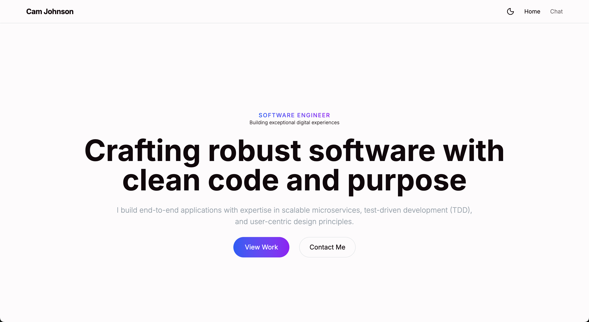

# Cam Johnson — Frontend Portfolio



Hi, I'm Cam. This repo is my personal portfolio site: a polished, fast, and accessible frontend built with TypeScript, React, Vite and Tailwind. Use it to preview my work, run locally, or deploy as a single-page demo for interviews.

**Quick Start**

Run locally:

```bash
npm install
npm run dev
# open http://localhost:5173 (or the port shown in the terminal)
```

**Highlights**

- **Curated projects:** Each listing includes context, tech used, and links to the live demo + source.
- **Responsive & accessible:** Semantic markup, keyboard support, and color-contrast mindful styles.
- **Theme support:** Light / dark toggle showcasing attention to UX polish.

**Tech stack & notable libraries**

- **Core:** TypeScript, React, Vite
- **Styling:** Tailwind CSS
- **UI primitives:** Radix UI and a small design system in `src/components/ui`
- **Animation:** Framer Motion
- **Tooling:** ESLint, Prettier (use local `node_modules/prettier`), TypeScript

---

**Useful commands**

- Start dev server: `npm run dev`
- Build: `npm run build`
- Preview production build: `npm run preview`
- Lint: `npm run lint`

---

**Contact & Links**

- **Email:** cjohnson10176@gmail.com
- **LinkedIn:** https://www.linkedin.com/in/camjohnson-code
- **GitHub:** https://github.com/camjohnson-code
